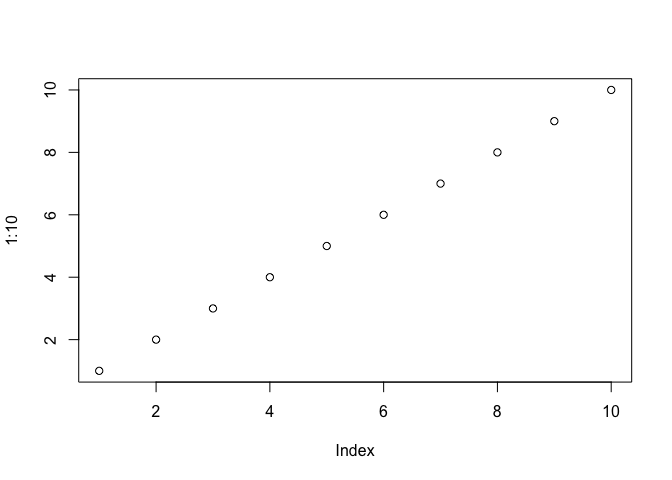

<!-- README.md is generated from README.Rmd. Please edit that file -->

# tidycode

The goal of tidycode is to allow users to analyze R expressions in a
tidy way.

## Installation

You can install tidycode from github with:

``` r
# install.packages("devtools")
devtools::install_github("LucyMcGowan/tidycode")
```

## Example

### Read in exisiting code

Using the matahari package, we can read in existing code, either as a
string or a file, and turn it into a matahari tibble using
`matahari::dance_recital()`.

``` r
code <- "
library(broom)
library(glue)
m <- lm(mpg ~ am, data = mtcars)
t <- tidy(m)
glue_data(t, 'The point estimate for term {term} is {estimate}.')
"

m <- matahari::dance_recital(code)
```

Alternatively, you may already have a matahari tibble that was recorded
during an R session.

Load the tidycode library.

``` r
library(tidycode)
```

We can use the expressions from this matahari tibble to extract the
names of the packages included.

``` r
(pkg_names <- ls_packages(m$expr))
#> [1] "broom" "glue"
```

Use the `get_packages_tbl()` to create a tibble of all functions
included in the packages that were used.

``` r
(pkg_tbl <- get_packages_tbl(pkg_names))
#> # A tibble: 2,401 x 2
#>    func            package
#>    <chr>           <chr>  
#>  1 augment         broom  
#>  2 augment_columns broom  
#>  3 bootstrap       broom  
#>  4 confint_tidy    broom  
#>  5 finish_glance   broom  
#>  6 fix_data_frame  broom  
#>  7 glance          broom  
#>  8 inflate         broom  
#>  9 tidy            broom  
#> 10 tidyMCMC        broom  
#> # … with 2,391 more rows
```

Create a data frame of your expressions, splitting each into individual
functions.

``` r
u <- unnest_calls(m$expr)
```

Left join the package tibble to classify your functions by package name.

``` r
u <- u %>%
  dplyr::left_join(pkg_tbl)
#> Joining, by = "func"
u
#> # A tibble: 8 x 4
#>   func      args        line package
#>   <chr>     <list>     <int> <chr>  
#> 1 library   <list [1]>     1 base   
#> 2 library   <list [1]>     2 base   
#> 3 <-        <list [2]>     3 base   
#> 4 lm        <list [2]>     3 stats  
#> 5 ~         <list [2]>     3 base   
#> 6 <-        <list [2]>     4 base   
#> 7 tidy      <list [1]>     4 broom  
#> 8 glue_data <list [2]>     5 glue
```

Add in the function classifications\!

``` r
classification_tbl <- get_classification_tbl()
u %>%
  dplyr::left_join(classification_tbl)
#> Joining, by = "func"
#> # A tibble: 10 x 7
#>    func      args        line package classification     n prevalence
#>    <chr>     <list>     <int> <chr>   <chr>          <int>      <dbl>
#>  1 library   <list [1]>     1 base    cleaning           1    0.00617
#>  2 library   <list [1]>     1 base    setup            161    0.994  
#>  3 library   <list [1]>     2 base    cleaning           1    0.00617
#>  4 library   <list [1]>     2 base    setup            161    0.994  
#>  5 <-        <list [2]>     3 base    <NA>              NA   NA      
#>  6 lm        <list [2]>     3 stats   modeling          17    1      
#>  7 ~         <list [2]>     3 base    <NA>              NA   NA      
#>  8 <-        <list [2]>     4 base    <NA>              NA   NA      
#>  9 tidy      <list [1]>     4 broom   <NA>              NA   NA      
#> 10 glue_data <list [2]>     5 glue    <NA>              NA   NA
```

### Extract Plots and Models *(this may get deprecated, we are looking into new ways to label functions)*

Using the matahari package, we can capture R expressions that are
called. For example, the following code will capture the two lines of R
code, a plot and a model.

``` r
library(tidycode)
```

``` r
matahari::dance_start()
plot(1:10)
```

<!-- -->

``` r
m <- lm(mpg ~ cyl, mtcars)
matahari::dance_stop()
expr <- matahari::dance_tbl()$expr
```

Let’s look at those expressions.

``` r
expr
#> [[1]]
#> sessionInfo()
#> 
#> [[2]]
#> matahari::dance_start()
#> 
#> [[3]]
#> plot(1:10)
#> 
#> [[4]]
#> m <- lm(mpg ~ cyl, mtcars)
#> 
#> [[5]]
#> sessionInfo()
```

We can check which expressions are plots using the `is_plot()` function.

``` r
is_plot(expr)
#> [1] FALSE FALSE  TRUE FALSE FALSE
```

We can check which expressions are calling modeling functions using the
`is_model()` function.

``` r
is_model(expr)
#> [1] FALSE FALSE FALSE  TRUE FALSE
```

Now let’s clean up\!

``` r
matahari::dance_remove()
```

## Contributing

We are crowdsourcing the function classification. If you would like to
contribute, you can fill out [this
form](https://docs.google.com/forms/d/e/1FAIpQLSfyDIVPC3cgKfplS3O7n-lCjWDLIzpCzgV2ffYAhyFuJaUooA/viewform?usp=sf_link)\!

Alternatively, this method may help you classify the functions faster:

``` r
library(tidycode)
library(googledrive)
library(tidyverse)

## Copy code from R script and paste it here as a string
code <- "
library(broom)
library(glue)
m <- lm(mpg ~ am, data = mtcars)
t <- tidy(m)
glue_data(t, 'The point estimate for term {term} is {estimate}.')
"

## Turn code into matahari data frame
m <- matahari::dance_recital(code)

## Unnest calls
c <- unnest_calls(m$expr)

## Send to Google Sheets
tmp <- tempfile(fileext = ".csv")
write.csv(c$func, tmp, row.names = FALSE)
s <- drive_upload(tmp,
                  type = "spreadsheet")

## Head to drive to update the sheet with 
## "Setup", "Exploratory", "Data Cleaning", "Modeling", "Evaluation"
## "Communication", "Import", or "Export"
drive_browse(s)

## Once you've finished classifying, convert to same format as the Google form
tmp <- tempfile(fileext = ".csv")
drive_download(file = s,
               path = tmp) 
c_ <- read_csv(tmp)
colnames(c_) <- c("func", "classification")
c_ %>%
  group_by(classification) %>%
  summarise(func = toString(func))
#> # A tibble: 4 x 2
#>   classification func            
#>   <chr>          <chr>           
#> 1 data cleaning  tidy, glue_data 
#> 2 model          lm              
#> 3 setup          library, library
#> 4 NA             <-, ~, <-       
```

Currently, the model and plot functions work by pulling in all functions
from certain packages that are intended for modeling and plotting. To
add more functions, update the files in the
[`data-raw`](https://github.com/LucyMcGowan/tidycode/tree/master/data-raw)
folder.
